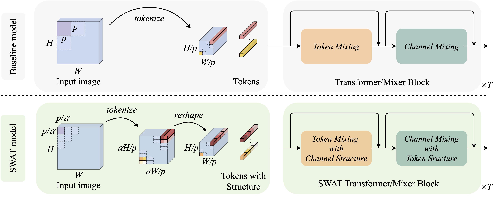

# SWAT: Spatial Structure Within and Among Tokens

This repository contains the official PyTorch implementation for our IJCAI 2023 paper titled "[SWAT: Spatial Structure Within and Among Tokens](https://arxiv.org/abs/2111.13677)".

### Introduction


Modeling visual data as tokens (i.e., image patches) using attention mechanisms, feed-forward networks or convolutions has been highly effective in recent years. Such methods usually have a common pipeline: a tokenization method, followed by a set of layers/blocks for information mixing, both within and among tokens. When image patches are converted into tokens, they are often flattened, discarding the spatial structure within each patch. As a result, any processing that follows (eg: multi-head self-attention) may fail to recover and/or benefit from such information. In this paper, we argue that models can have significant gains when spatial structure is preserved during tokenization, and is explicitly used during the mixing stage. We propose two key contributions: (1) **Structure-aware Tokenization** and, (2) **Structure-aware Mixing**, both of which can be combined with existing models with minimal effort. Our Structure-aware Tokenization converts image patches to tokens, but preserves the spatial structure within a patch as channel segments of the corresponding token. Our Structure-aware Mixing benefits from the preserved structure by considering local neighborhoods both within and among tokens, based on 2D convolutions. With these two contributions, we introduce a family of models (SWAT), showing improvements over the likes of DeiT, MLP-Mixer and Swin Transformer, across multiple benchmarks including ImageNet classification and ADE20K segmentation. 



### Quick Start

#### Finding key code snippets:
- Changes to code are marked within `<START>` `<END>` annotations.
- Structure-aware tokenization is implemented in `./timm/models/layers/patch_embed.py`
- MLP --> Conv is implemented in `./timm/models/layers/mlp.py`
- Structure-aware Mixing is implemented in:
  - `./timm/models/mlp_mixer.py`
  - `./timm/models/vision_transformer.py`
  - `./timm/models/swin_transformer.py`
- FLOP counting is in `./count_flops.py`
- Config files are in:
  - `./config/mixer_i1k_scratch.yaml`
  - `./config/vit_i1k_scratch.yaml`
  - `./config/swin_i1k_scratch.yaml`

#### To run the code on 8 gpus:
download the imagenet-1k dataset, and run,
`./distributed_train.sh 8 <IMAGENET_1K_DIR> --config <CONFIG_FILE>`


### Reference

If you find this useful, please consider citing our work:
```
@inproceedings{kahatapitiya2023swat,
  title     = {SWAT: Spatial Structure Within and Among Tokens},
  author    = {Kahatapitiya, Kumara and Ryoo, Michael S.},
  booktitle = {Proceedings of the Thirty-Second International Joint Conference on Artificial Intelligence, {IJCAI-23}},
  publisher = {International Joint Conferences on Artificial Intelligence Organization},
  year      = {2023},
  doi       = {10.24963/ijcai.2023/106},
  url       = {https://doi.org/10.24963/ijcai.2023/106},
}
```

### Acknowledgements

This project is based on [timm](https://github.com/rwightman/pytorch-image-models). I would like to thank the contributors.
